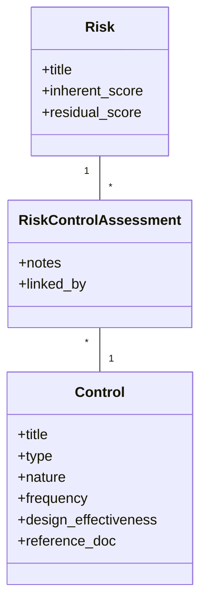

# Controls Module Design Specification - Executive Summary

**Document Type:** Design Specification  
**Project:** Operational Risk Management Platform - Controls Module  
**Version:** 1.01  
**Date:** December 2, 2025  
**Status:** Approved  

---

## Executive Summary

### Purpose
This document defines the functional requirements and data model for the **Controls (Mitigation)** module. It formalizes the approach for managing the centralized library of internal controls and their linkage to risks.

### Decision Summary
**Architecture:** Separate `controls` Application.
**Effectiveness Model:** Iterative Approach (Phase 1: Design Effectiveness on Control; Phase 2: Operating Effectiveness on Linkage).

**Key Rationale:**
- **Centralization:** Controls are permanent process artifacts reused across multiple risks.
- **Separation of Concerns:** Distinguishes the "Defense" layer (Controls) from the "Threat" layer (Risks).
- **Future-Proofing:** A separate app enables future expansion into Control Testing and Compliance without bloating the Risks module.

---

## 1. Problem Statement

### Business Need
To effectively manage operational risk, the organization requires a system to:
1.  Maintain a centralized inventory of preventive, detective, and corrective controls.
2.  Standardize control definitions to prevent duplication across business units.
3.  Link specific controls to identified risks to justify residual risk scores.
4.  Track the design effectiveness of controls.

### Scope
**In Scope (MVP):**
* Control Library Management (CRUD).
* Attributes: Type, Nature, Frequency, Design Effectiveness.
* Linkage: Many-to-Many mapping between Risks and Controls.
* Audit Trail: Reference documentation links.

**Deferred (Phase 2):**
* Control Testing (Design & Operating effectiveness testing cycles).
* Compliance/Regulatory mapping (e.g., SOX, GDPR).
* Incident-Control linkage (Root cause analysis).

---

## 2. Functional Requirements

### 2.1. Control Library (The "Defense" Inventory)
The system must maintain a library of controls that exist independently of any specific risk.

* **Uniqueness:** Controls are unique entities defined by their mechanism (e.g., "Dual Signature on Payments > $10k").
* **Ownership:** Controls are owned by a **Business Unit** and managed by a specific **Owner** (User).
* **Lifecycle:** Controls have an active/inactive status but do not follow a complex workflow in MVP (unlike Risks/Measures).

### 2.2. Control Attributes
Each control must capture specific characteristics to support reporting and assessment:

| Attribute | Description | Options / Logic |
| :--- | :--- | :--- |
| **Type** | The timing of the mitigation relative to the risk event. | • **Preventive:** Stops the event (e.g., Locks). • **Detective:** Identifies the event (e.g., Reconciliations). • **Corrective:** Fixes the impact (e.g., Backups). |
| **Nature** | The method of execution. | • **Manual:** Human action. • **Automated:** System logic. • **Hybrid:** IT-dependent manual. |
| **Frequency** | How often the control operates. | Daily, Weekly, Monthly, Event-Driven, etc. |
| **Design Effectiveness** | The inherent strength of the control design (assuming perfect operation). | **Scale 1-5** (1=Ineffective, 5=Strong). *Note: In MVP, this is a static attribute of the Control.* |

### 2.3. Risk-Control Linkage
* **Many-to-Many:** A single control can mitigate multiple risks; a risk is mitigated by multiple controls.
* **Justification:** The link must capture *why* this control applies (Notes/Mapping Logic).
* **Location:** The link model (`RiskControlAssessment`) resides in the `risks` app to avoid circular dependencies (Risks depend on Controls).

---

## 3. Data Model Design

### 3.1. Entity Relationship Diagram (ERD) Concept

### 3.2. Detailed Schema Specifications

#### `controls.Control`

| Field | Type | Required | Notes |
| :--- | :--- | :--- | :--- |
| `title` | Char | Yes | Name of the control mechanism. |
| `description` | Text | Yes | Detailed procedure. |
| `reference_doc` | Char | No | Link to policy/procedure URL. |
| `control_type` | Choice | Yes | Preventive / Detective / Corrective. |
| `control_nature` | Choice | Yes | Manual / Automated / Hybrid. |
| `frequency` | Choice | Yes | Daily / Monthly / Event-Driven / etc. |
| `effectiveness` | Int | No | 1-5 Rating (Design Effectiveness). |
| `is_active` | Bool | Yes | Default True. Soft deletion/archiving. |
| `business_unit` | FK | Yes | Unit responsible for the control. |
| `owner` | FK | Yes | User responsible for maintenance. |

#### `risks.RiskControl` (Link Table)

| Field | Type | Required | Notes |
| :--- | :--- | :--- | :--- |
| `risk` | FK | Yes | Parent Risk. |
| `control` | FK | Yes | Mitigating Control. |
| `notes` | Text | No | Justification for mapping. |
| `linked_by` | FK | No | User who created the link. |

-----

## 4. Operational Workflows

### 4.1. Creating a Control

1.  **Actor:** Risk Officer.
2.  **Action:** Creates a new Control entry in the library.
3.  **Data:** Defines Title, Type, Nature, Frequency, and Design Effectiveness (e.g., "Rated 4/5 based on dual-factor design").
4.  **Result:** Control is available in the library for linking.

### 4.2. Linking to a Risk (RCSA Process)

1.  **Actor:** Risk Officer (during Risk Assessment/Validation).
2.  **Context:** Viewing a specific Risk (e.g., in `ASSESSED` state).
3.  **Action:** Selects "Add Control", searches the Library for relevant controls.
4.  **Refinement:** If the control doesn't exist, they create it in the Library first.
5.  **Result:** Control is linked. The Risk's *Residual Score* can now be justified by the presence of these controls.

-----

## 5. Future Roadmap (Phase 2)

The architecture is designed to support the following future capabilities without refactoring:

1.  **Operating Effectiveness:**

      * Add `operating_effectiveness` field to the `RiskControl` link table.
      * This allows the same control to be rated "Effective" for Risk A but "Partially Effective" for Risk B (contextual performance).

2.  **Control Testing:**

      * Add `ControlTest` model in the `controls` app.
      * Schedule periodic tests (e.g., "Sample 30 transactions").
      * Update effectiveness scores based on test results.

-----

## Appendix: Definitions

  * **Design Effectiveness:** Does the control *theoretically* mitigate the risk if it works as intended? (e.g., A lock on a door is Design Effective for preventing entry).
  * **Operating Effectiveness:** Does the control work *in practice* over time? (e.g., If the staff leaves the door propped open, the lock is Operating Ineffective).
  * **Preventive:** Acts *before* the threat materializes (e.g., Firewalls).
  * **Detective:** Acts *during or after* to flag the issue (e.g., Intrusion Detection logs).

